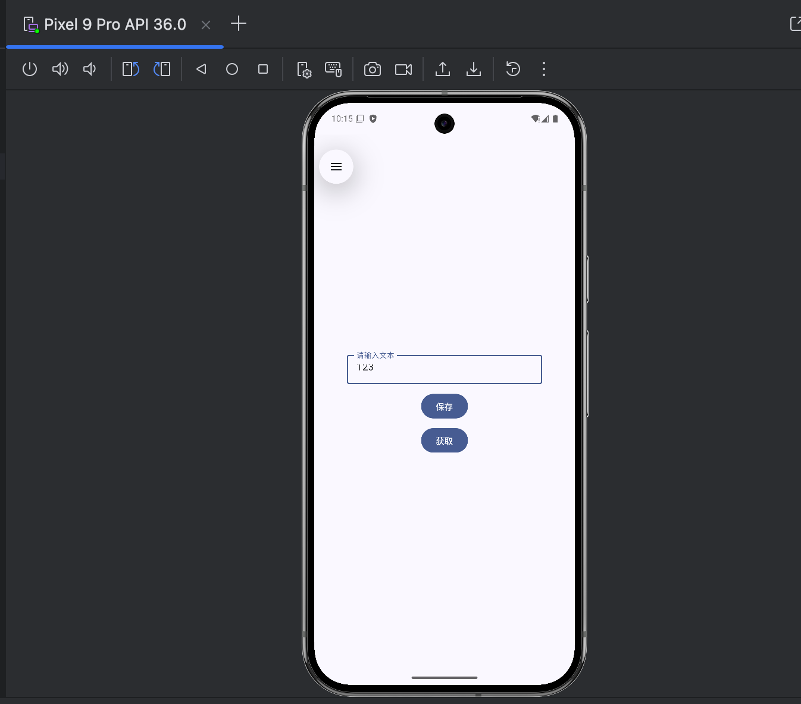
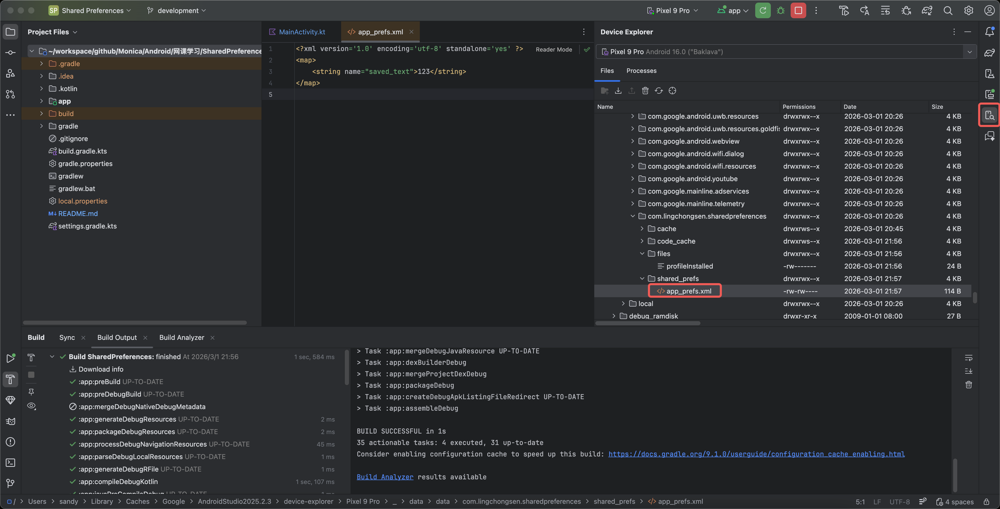

# 🤖 SharedPreferences 教程演示

欢迎来到 Android 学习仓库！这个项目是一个超级简单的 **SharedPreferences** 使用示例，适合初学者快速上手。

📦 功能亮点：

1. 💾 创建 `SharedPreferencesStore` 类，封装增删改查方法。
2. 📝 界面有一个输入框，支持用户键入任意文本。
3. 🔘 “保存”按钮：点击后将内容写入 SharedPreferences。
4. ✅ 保存成功时显示 Toast 提示：`数据已经保存成功`。
5. 🔍 “获取”按钮：读取刚刚保存的数据，并通过 Toast 显示出来。

---

## 🛠️ 运行步骤

1. 克隆仓库：

   ```bash
   git clone <your-repo-url>
   ```

2. 使用 Android Studio 打开 `Android/网课学习/SharedPreferences` 文件夹。
3. 同步 Gradle，构建并在模拟器或真机上运行 `app` 模块。
4. 输入文本后点击保存，查看提示，然后点击获取查看结果。

👉 如果你想自己实现扩展（比如增加清除按钮、修改键名等），欢迎随意 Fork！

---

## 📁 目录结构简要说明

```text
SharedPreferences/
├── app/                 # Android Studio 项目
│   └── src/main/java/com/lingchongsen/sharedpreferences/
│       ├── MainActivity.kt          # UI 逻辑
│       └── SharedPreferencesStore.kt # 存储辅助类
└── README.md           # 当前文档
```

---

## 🖼️ 示例界面

下面是应用运行时的两个截图（仅示意）：




---

✨ 欢迎提 PR 或者给我一个 ⭐️！

Happy Coding! 😄
